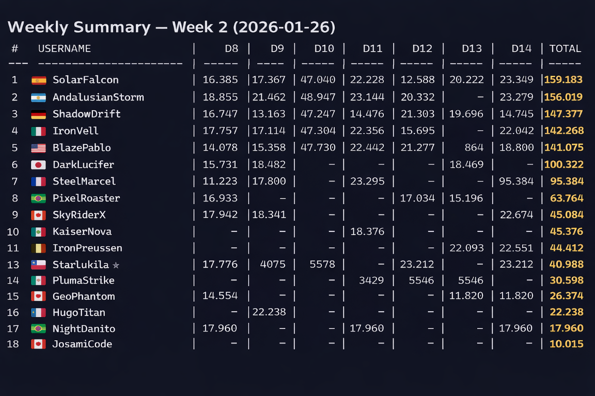
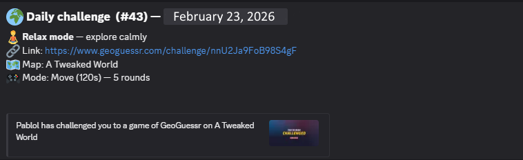

# GeoGuessr Daily Challenge Bot


A fully automated Discord bot for managing **daily GeoGuessr challenges**, tracking results, and publishing **weekly, monthly, and yearly summaries** with stats, rankings, and fun messages.

This project is based on (and heavily extended from) `daily-geoguessr-bot` (by sh-mug: https://github.com/sh-mug/daily-geoguessr-bot), rewritten in **Node.js + TypeScript (ESM)** with a focus on automation, data integrity, and long-term league tracking.

---
## 📋 Prerequisites

Before installing the bot, make sure you have:

### 1️⃣ Discord Bot Application
- A Discord account
- A Discord application with a bot added to it  
- A bot token generated from the Discord Developer Portal  
- The bot invited to your server with the required permissions  

You can create and manage your bot here:  
https://discord.com/developers/applications

Required permissions typically include:
- Send Messages
- Attach Files
- Use Slash Commands
- Embed Links
- Manage Roles (if using role mentions)

---

### 2️⃣ GeoGuessr Account
- A valid GeoGuessr account  
- An active subscription that allows you to create challenges  

Without a subscription, challenge creation will fail.

---

### 3️⃣ Node.js
- Node.js 20+ recommended  
- npm installed  

Check your version:

```bash
node -v
npm -v
```
---

## 📦 Installation

```bash
git clone https://github.com/yourname/GeoGuessr-Daily-Challenge-Bot.git
cd GeoGuessr-Daily-Challenge-Bot
npm install
npm run build
npm start
```



---

## ✨ Features

### 🗺️ Daily Challenges
- Automatically creates a new GeoGuessr challenge every day
- Smart **map selection** with:
  - Weighted randomness
  - Cooldowns to avoid repetition
  - Mode restrictions per map
- Dynamic settings:
  - **5 or 10 rounds**
  - Time limits (10s, 20s, 30s, 60s... move with 60–120s)
- Fun, contextual Discord messages depending on the challenge type




### 🌍 Multi-language Support
- Bot messages available in multiple languages
- Easy-to-add translation files
- Add a new language by creating a JSON file in the translations folder
- Supported languages: English, Spanish, German, French, Italian, Portuguese

### 📊 Results & Tracking
- Fetches daily highscores from GeoGuessr
- Stores all data in a single JSON store (`league.json`)
- Players tracked by **GeoGuessr userId**
- Late plays supported via **weekly resync**

### 🏆 Weekly Summary
- Automatic weekly league (Monday → Sunday)
- Podium 🥇🥈🥉
- Perfect attendance (7/7)
- Extra awards
- Full ranking table rendered as PNG
- Weekly resync ensures late players are included

### 📅 Monthly & Yearly Summaries
- Total points
- Days played
- Best average score
- Biggest improvement
- Most played maps
- Mode distribution
- Global yearly ranking

### 🖼️ Table Rendering
- Weekly tables rendered as **PNG images**
- Mobile-friendly
- Country flags (Twemoji)
- Temporary images auto-deleted after posting

### 👤 Discord ↔ GeoGuessr Linking
- `/link <geoguessrUserId>`
- `/unlink` (admin-only)
- One GeoGuessr ID ↔ one Discord user
- Stored in `league.json`

### 🔔 Role Mentions
- Optional `@Daily Challenge` role mention
- Opt-in notification system
- Safe mentions via `allowedMentions`

---

## 🧱 Architecture

- Node.js (ESM) + TypeScript
- JSON-based storage (no database)
- Modular structure:
  - `league/`
  - `discord/`
  - `geoguessr/`
- Express server for manual endpoints
- Cron jobs
- PM2 for production

---

## 📂 Data Format (`league.json`)

```json
{
  "weeks": {
    "2026-01-19": {
      "weekStart": "2026-01-19",
      "weekIndex": 12,
      "days": {
        "2026-01-21": {
          "date": "2026-01-21",
          "dayIndex": 736,
          "token": "abc123",
          "mapId": "community_world",
          "mapName": "A Community World",
          "mapUrl": "https://www.geoguessr.com/maps/...",
          "mode": "nm",
          "rounds": 5,
          "timeLimit": 30,
          "scores": {
            "geoUserId": 23456
          }
        }
      },
      "postedAt": "2026-01-26T23:00:00.000Z"
    }
  },
  "players": {
    "geoUserId": {
      "nick": "PlayerName",
      "country": "ES",
      "discordId": "1234567890"
    }
  }
}
```

---

## 🔐 Environment Variables

Create a `.env` file in the root of the project (or modify `.env.example`).

⚠️ IMPORTANT  
Do NOT use `#` inside any token or password — it will be treated as a comment and break parsing.
Do NOT commit your .env to version control.
Make sure .env is included in your .gitignore.
Keep your .env private.

```env
# --------------------------------------
# GeoGuessr Authentication (Challenge Creation)
# --------------------------------------
GEOGUESSR_EMAIL=your_email
GEOGUESSR_PASSWORD=your_password

# --------------------------------------
# Discord Configuration
# --------------------------------------
DISCORD_TOKEN=your_discord_bot_token
DISCORD_CHANNEL_ID=channel_id_for_posts

# Required for slash commands (/link, /unlink)
DISCORD_GUILD_ID=your_server_id

# Admin(s) allowed to use /unlink
MY_DISCORD_ID=123456789012345678

# Optional role mention for daily challenge posts
DISCORD_ROLE_DAILY_ID=098765432101234564321

# --------------------------------------
# Custom Message Endpoint
# --------------------------------------
# Token required to use the /say endpoint
ADMIN_TOKEN=abcdef1234567890abcdef1234567890

# --------------------------------------
# Bot Language
# --------------------------------------
# Available: en, es, fr, de, it, pt
BOT_LANG=en

# --------------------------------------
# League Configuration
# --------------------------------------
LEAGUE_START_DATE=2026-01-12
WEEK_INDEX_START=1
DAY_INDEX_START=1
```

---

## 🍪 Geoguessr Cookie Requirement

This project requires a valid `_ncfa` cookie from GeoGuessr in order to fetch certain data.

Instructions to obtain your `_ncfa` cookie are available here:

https://github.com/SafwanSipai/geo-insight?tab=readme-ov-file#getting-your-_ncfa-cookie

### Setup

1. Follow the instructions in the link above to obtain your `_ncfa` cookie.
2. In the root of this project, locate the file:

```
cookie_example.txt
```

3. Rename it to:

```
cookie.txt
```

4. Paste your `_ncfa` cookie value inside `cookie.txt`.

The file should contain **only the cookie value**, nothing else.

Example:

```
_ncfa=your_cookie_value_here
```

⚠️ Important:
- Do NOT commit `cookie.txt` to version control.
- Make sure `cookie.txt` is included in your `.gitignore`.
- Keep your cookie private.

Without a valid cookie, GeoGuessr API requests will fail.

---
## 🚀 Useful Commands

```bash
npm install
npm run build
npm run build -- --watch
npm start
```

---

## 🖥️ PM2 (Production)

### Install PM2

```bash
sudo npm install -g pm2
```

### Start Processes

```bash
pm2 start dist/server.js --name geodaily -- --standalone
pm2 start dist/server.js --name geodaily
pm2 start dist/linkBotMain.js --name geodaily-link
```

---

## ⏱️ Cron Mode (PM2)

```bash
pm2 start npm \
  --name geodaily \
  --cwd /home/user/daily_challengue/daily-geoguessr-bot \
  --cron-restart="10 3 * * *" \
  -- run standalone

pm2 start npm \
  --name geodaily-link \
  --cwd /home/user/daily_challengue/daily-geoguessr-bot \
  --cron-restart="15 3 * * *" \
  -- run linkbot
```

---

## 🔌 Manual Endpoints

```bash
curl http://localhost:25000/challenge
curl http://localhost:25000/highscores
curl "http://localhost:25000/weekly?weekStart=2026-01-19"
curl "http://localhost:25000/monthly?year=2026&month=01"
curl "http://localhost:25000/yearly?year=2026"
curl "http://localhost:25000/backfill?date=2026-01-21"
curl "http://localhost:25000/challenge/test?asDate=2026-02-02"
```

---

## 📣 Send Custom Message

```bash
token=ADMIN_TOKEN

curl -X POST "http://localhost:25000/say" \
  -H "x-admin-token: $token" \
  -H "Content-Type: text/plain; charset=utf-8" \
  --data-raw "Hello!"
```

---

## 🧠 Design Decisions

- JSON instead of DB
- GeoGuessr userId as primary key
- Weekly resync
- Image tables for readability
- Slash commands + DMs only

---

## 📝 License

MIT — please credit:

- Extended version: @PabloL4 (https://github.com/PabloL4/GeoGuessr-Daily-Challenge-Bot)
- Original concept: @sh-mug (https://github.com/sh-mug/daily-geoguessr-bot)

Made with ❤️ for GeoGuessr communities